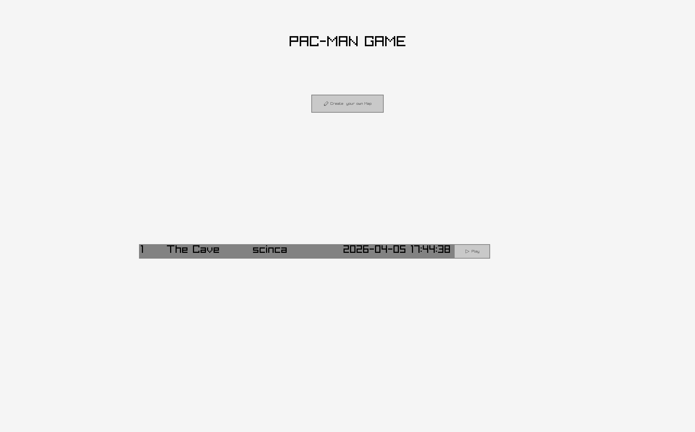
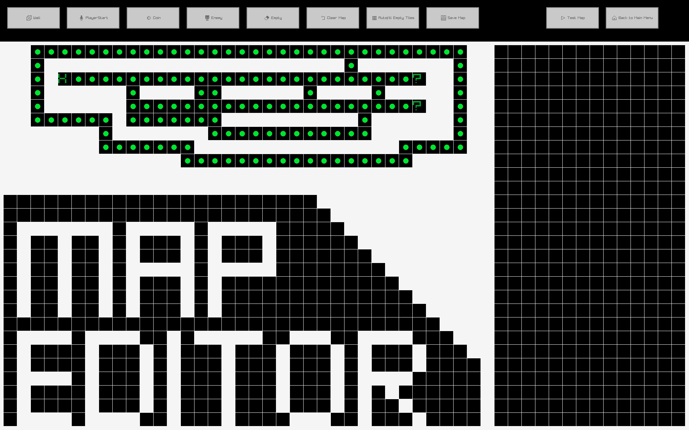
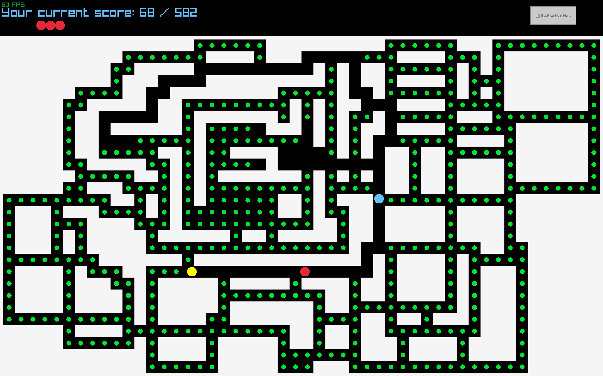

# Pac-Man game made with c++ and raylib
I made this project in order to improve in c++ programming.
This is first and foremost a learning project made by me.
If you want to distribute this program, you need to comply with the license ( as seen in this repo).

> I use Linux so I couldn't test against Window/Macos specific bugs. But according to github actions it compiles on these plattforms so it should be fine.

## Technologies uses

+ C++ 23
+ Raylib/Raygui
+ Sqlite
+ CMake
+ Git

## Features

This project features:

+ a default map
+ a map creator that lets you make your own maps
+ a score system ( to collect coins and display a win message)
+ player movement via both arrow and WASD keys
+ Enemy 'AI' that finds shortest path to the player (you) via a Breadth-First-Search algorithm
+ a *great* way to have fun


## Screenshots
### Game Menu

### Map Editor

### Gameplay

### Win Screen


## How to Run

### Prerequisites
- CMake 3.20 or higher
- C++23 compatible compiler  (This is required for std::expected)
- git
- an internet connection (cmake will download raylib and raygui)

### Build and Run
```bash
git clone https://github.com/scinca/pacman-cpp.git

 
cd pacman-cpp
mkdir build && cd build
cmake ..
cmake --build .

#linux / macos 
./pacman_cpp

#windows
.\pacman_cpp.exe
```

**Note:** If dependencies aren't installed it automatically downloads and compiles them. This takes a looong time.

## Disclosure of AI usage

This project was made by me. However, I used Claude 4.6 Sonnet in learning mode to help me with:

- designing the (now removed) initial map that was used before I had a working map creator ( writing 1400 '#' or '0' is insane and i started with game logic and not the map creator) 
- Making some parts of the cmake
- Some brainstorming about how to implement certain functionality ( but the code was written by me)
- questions about cpp and programming in general ( like which function does this, what data structure is best for this)
- debugging certain things where I got stuck.
- some of the more complex and tedious to do by hand math 
